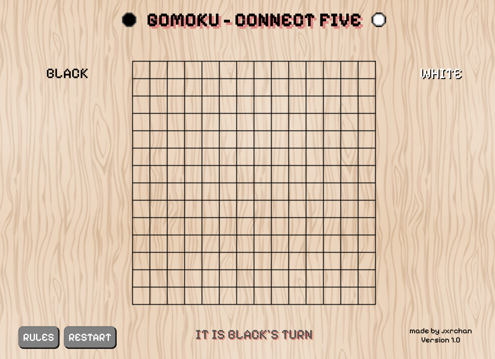
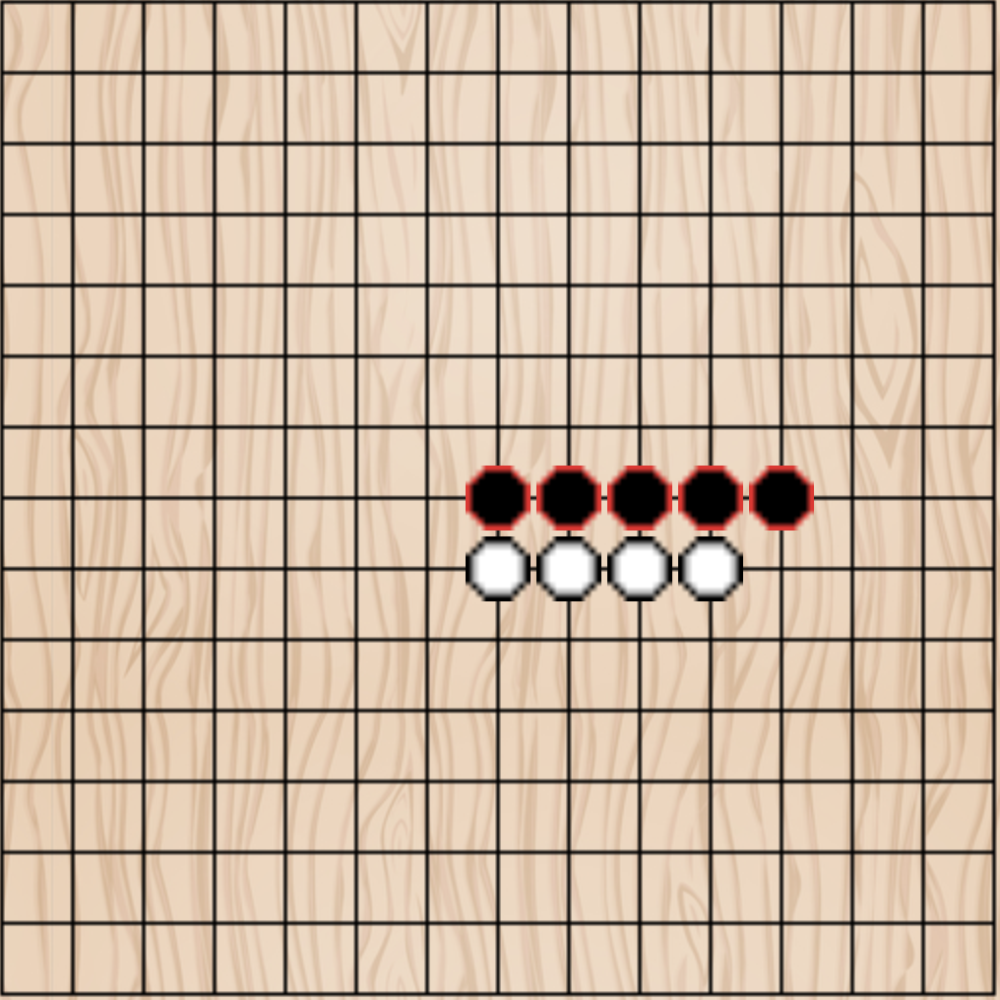
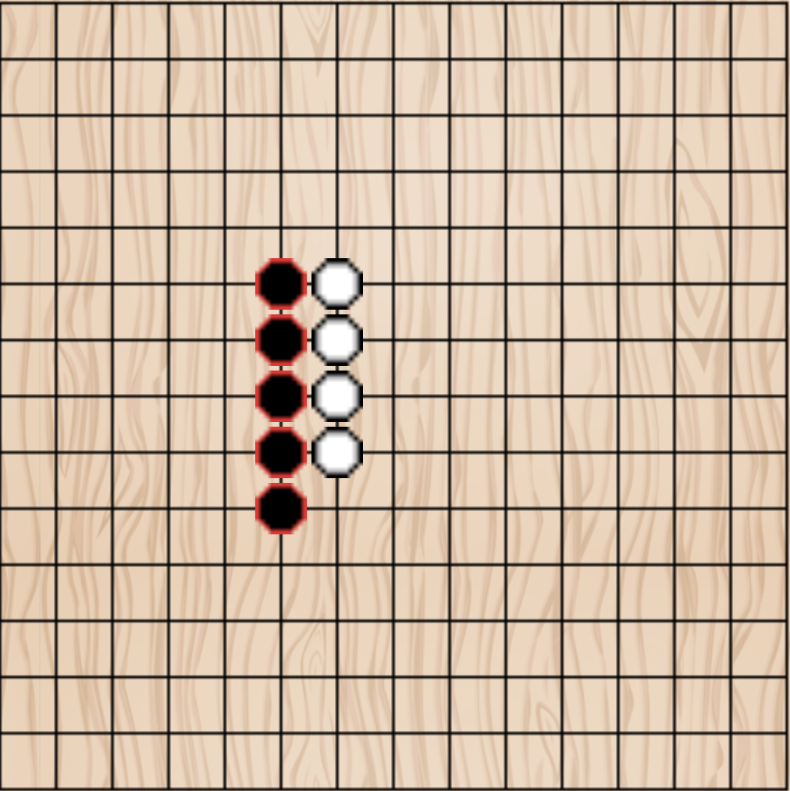
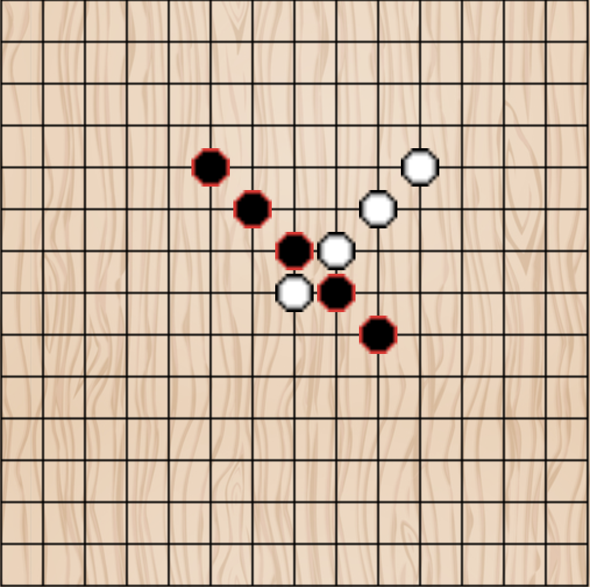
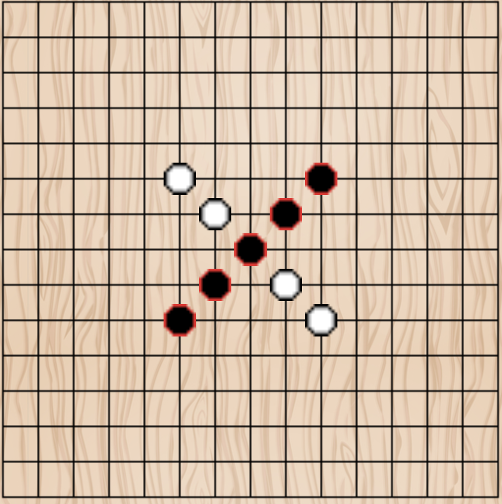

# GOMOKU - CONNECT FIVE

## Background:

Go-moku is a traditional Japanese strategy board game which dates back to the 17th century. _Go_ translates to five and _-moku_ translates to pieces. This naming convention is reflected in the Chinese and Korean terms for the game as well, where it is called 五子棋 (wu-zi-qi) and 오목 (o-mok) respectively. As its name implies, the objective of the game is simple — get five pieces of the same colour in a row.

This rendition of Go-moku pays homage to traditional and modern styles of the game. It offers multiple game formats, allowing players to customise the playing board ('Go-Board') size and the rules ('Freestyle' or 'Tournament'). In doing so, I endeavour to bring this ubiquitous game to both the casual and competitive boardgame player.

Access my version of Gomoku here:
https://jxrchan.github.io/gomoku/

## Technologies Used:

- HTML 5
- CSS 3
- Javascript - VanillaJS

## Instructions

There are two players in Gomoku. These players take turns placing their black or white game pieces on an empty intersection on the grid board. Black starts the game first. As earlier described, the winner is the first player to form an unbroken line of five stones of their color. This line can be horizontal, vertical, and diagonal directions. See examples of victories below.

 
If the board is completely filled and no one can make a line of 5 stones, then the game ends in a draw.

### Game Settings

Before beginning this game, you are also prompted to choose the board size you want to play on and the format of the game.

**Board Size:**

Choose between playing on a 15x15 grid board or a 19x19 board. Traditional Gomoku is played on a 19 board. In recent decades, however, the 15 board has grown to become the norm. It is now the default size for international tournaments.

That being said, some argue that having a bigger board allows for more complex and diffuse strategies. Countries like Korea also still maintain the 19 board. If you are purists like them, or are someone who likes to experiment with strategies, you can consider playing with this bigger board.

**Format:**

Free play or freestyle Gomoku simply involves the black and white player taking turns, from the beginning of the game and with no variation throughout. Players are free to put their pieces on any unoccupied intersection during the game. This is the most casual and no-frills form of the game.

Tournament gomoku addresses the inherent advantage the black player has for starting the game. In 2009, the Swap2 protocol became the gold standard equalising mechanism by which the game becomes balanced for White. This has been programmed into the extant game. Black and white players start off as tentative. Black places two black and one white piece to begin. White, now has three options:

1. Remain as White and place a second white stone
2. Swap their color and play as Black
3. Play one black and one white piece, and defer the choice of which color to play back to Black.

The unpredictability of White's initial decision makes it impossible for Black to study and predict different lines of attack.

## Credits & Attributions:

- This game uses the Pixelify Sans font designed by Stefie Justprince
- The background image was obtained from Freepik and was contributed by user: macrovector
- The codes for building the Gomoku board, setting pieces, and checking for a winner was adapted from Youtube user, Kenny Yip Coding's video on building the game of Connect Four. 

## Next Steps:

Future iterations of the project may include the following:

- Timer with 10 minute time limit for each player to make all their moves. The timer freezes when a player completes his turn. A player loses if he or she runs out of time even if no one has obtained five pieces in a row
- Additional winning logic to disallow victories where six or more pieces are in line (known as the 'overline' rule)
- Audio for when buttons are clicked, pieces are set, and victory is achieved
- Option to play against a CPU
